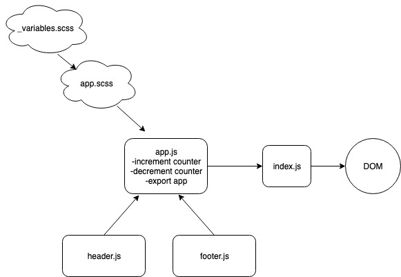

#  LAB

## lab-27-react-testing

### Author: Bonnie Wang

### Links and Resources

- [submission PR](https://github.com/jcbwang/lab-26-component-based-ui)
- [netlify](https://frosty-cray-139f2c.netlify.com/)
- [aws s3](https://lab-27-react-deploy.s3.amazonaws.com/public/index.html)
- [aws amplify](https://submissin.d3nrxtxu3uh77t.amplifyapp.com/)

#### Documentation

- [styleguide](http://xyz.com) (React assignments)

### Modules

#### `app.js` -> compiling all components

#### `index.js` -> diffing app elements to dom

#### `footer.js`

#### `header.js`

#### `counter.js`

#### Running the app

- `npm run start`

#### Testing

- `npm run test`
- tests counter functionality, proper rendering, and snapshots

#### UML

